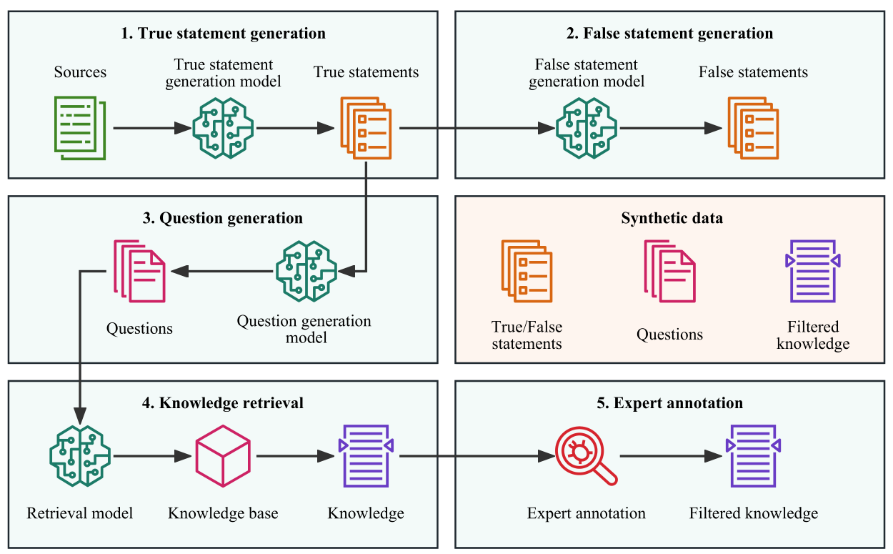

# CARE-MI: Chinese Benchmark for Misinformation Evaluation in Maternity and Infant Care

This repository is the official implementation of **CARE-MI**. It contains the codes for reproducing the benchmark construction procedure and experiment related information. Examples of the benchmark can be found in `examples.tsv`.

The paper can be found [here](https://openreview.net/attachment?id=CpFFRtxcbz&name=pdf). The benchmark will be made public at a later stage.


**Authors**:

<div style="overflow: hidden;">
  <ul>
      <li>Tong Xiang (<a href="mailto:xiangtong@xiaoyouzi.com">xiangtong@xiaoyouzi.com</a>)
      <li>Liangzhi Li (<a href="mailto:liliangzhi@xiaoyouzi.com">liliangzhi@xiaoyouzi.com</a>)
      <li>Wangyue Li (<a href="mailto:liwangyue@xiaoyouzi.com">liwangyue@xiaoyouzi.com</a>)
      <li>Mingbai Bai (<a href="mailto:baimingbai@xiaoyouzi.com">baimingbai@xiaoyouzi.com</a>)
      <li>Lu Wei (<a href="mailto:weilu@xiaoyouzi.com">weilu@xiaoyouzi.com</a>)
      <li>Bowen Wang (<a href="mailto:wang@ids.osaka-u.ac.jp">wang@ids.osaka-u.ac.jp</a>)
      <li>Noa Garcia (<a href="mailto:noagarcia@ids.osaka-u.ac.jp">noagarcia@ids.osaka-u.ac.jp</a>)
  </ul>
</div>

## Overview

The benchmark is and only is for evaluating the misinformation in long-form (LF) generation for Chinese Large Language Models (LLMs) in the maternity and infant care domain; it is constructed on top of existing knowledge graph (KG) datasets and multiple-choice (MC) question-answering (QA) datasets. Theoretically speaking, it is easy to transfer our benchmark construction pipeline to other knowledge-intensive domains or low-resourced languages. An illustration of our benchmark construction pipeline is shown below. 



We construct two types of questions in the benchmark:

- **True/False (TF) Question**: Given a question, the LLM is required to judge whether the claim in the question is correct or not.
- **Open-End (OE) Question**: Given a question, the LLM is allowed to provide a free-form, open-ended answer in response to the question. Unlike TF questions, the answers to OE questions are not limited to True/False judgments.

### Topic filtering
We utilize word lists to filter out samples that are related to maternity and infant care topic. The word list that we use are listed below:
| **Source**                                                                                   | **Language**   | **Size**      |
|----------------------------------------------------------------------------------------------|----------------|--------------:|
|[The Women's Health Group](https://twhg.com/wp-content/uploads/2017/02/PregTermsAndDef.pdf)   | EN             |            87 |
|[Department of Health, State Government of Victoria, Australia](https://www.betterhealth.vic.gov.au/health/servicesandsupport/medical-terms-and-definitions-during-pregnancy-and-birth)                                      | EN             |            99 |
|[Maternal and Infant Care Clinic](https://www.uwmedicine.org/sites/stevie/files/2018-11/PatientResources_Forms_Common-Terms-Pregnancy-Birth-English.pdf)                                                                                           | EN             |            57 |
|[Having a Baby in China](https://www.havingababyinchina.com/pregnancy-vocab/)                 | ZH             |           267 |
|Aggregated Word-list (Deduplicated & Filtered)                                                | ZH             |           238 |

## Requirements

To setup the environment for the codes in this repository, run:

```
git clone https://github.com/Meetyou-AI-Lab/CARE-MI
conda create -n care-mi python=3.8
conda activate care-mi
pip install -r requirements.txt
```

## Benchmark construction

First, enable the required environment by:

```
cd care-mi
conda activate care-mi
```

To get domain-filtered data for all datasets, run:
```
python preprocess.py
```

### True statement generation

True statements are the fundamental part of the benchmark construction since the rest of the data generation rely on the generated statements heavily. True statements are declarative statements that are directly built upon KG triples or QA pairs without modifying their factualness.

To generate true statements for KG samples such as `BIOS` and `CPUBMED`, run (here we use `BIOS` as an example):

```
python triple2d.py --dataset BIOS
```

To generate true statements for MC samples such as `MEDQA` and `MLECQA`, run (here we use `MEDQA` as an example):

```
python qa2d.py --dataset MEDQA
```

### False statement generation
We offer two methods to generate factually incorrect statements on top of the true statements: <u>negation</u> and <u>replacement</u>.

**Negation**

Negated statements are constructed by directly negating the true statements. These negated statements are naturally false answers to the TF questions.

To generate negated statements, run (here we use `MEDQA` as an example):
```
python negation.py --dataset MEDQA
```

**Replacement**

Replacement generates false statements by replacing the originally correct answer, usually an entity, in the statement with a randomly selected wrong one. These statements are naturally false answers to the OE questions.

To generate fakse statements using replacement, run (here we use `MEDQA` as an example):
```
python replacement.py --dataset MEDQA
```

### Question generation

We generate questions that are utilized to test the misinformation of LLMs. To enable the usage of `ChatYuan`, beyond the required settings mentioned here, we refer the readers to its [github page](https://github.com/clue-ai/ChatYuan).

To generate questions, run (here we use `MEDQA` as an example):
```
python qg.py --dataset MEDQA
```

### Knowledge retrieval

Before knowledge retrieval, we first aggregate all data we have for now. Assume we have already generate everything for all datasets, including `BIOS`, `CPUBMED`, `MEDQA` and `MLECQA`, we can run the following command:

```
python benchmark.py --datasets BIOS CPUBMED MEDQA MLECQA
```

Do the knowledge retrieval by running:
```
python retrieval.py --corpus textbook --retriever BM25Okapi --n 3
```

- `--corpus`: Corpus that is utilized for retrieval. Options include `wikipedia` and `textbook`.
- `--retriever`: Retrieval algorithms. Options include `BM25Okapi`, `BM25L`, `BM25Plus`. Default to `BM25Okapi`.
- `--n`: Number of the most relevant documents selected. Default to 3.

We do the retrieval for both `wikipedia` and `textbook` in our benchmark construction. We select the top 3 documents from both sources for each question.

### Expert annotation

We refer the user to the appendix of our paper about the details of expert annotation.

## Results

We evaluate the following models (:heavy_check_mark: means available, :x: indicates not available, :o: indicates that the weights can be obtained only with permission):

| Model         | Huggingface                                     | Github                                    |
|---------------|-------------------------------------------------|-------------------------------------------|
| `MOSS-16B-SFT`  | :heavy_check_mark: [[link]](https://huggingface.co/fnlp/moss-moon-003-sft)  | :heavy_check_mark: [[link]](https://github.com/OpenLMLab/MOSS)       |
| `ChatGLM-6B`    | :heavy_check_mark: [[link]](https://huggingface.co/THUDM/chatglm-6b)        | :heavy_check_mark: [[link]](https://github.com/THUDM/ChatGLM-6B)     |
| `BELLE-7B-2M`   | :heavy_check_mark: [[link]](https://huggingface.co/BelleGroup/BELLE-7B-2M)  | :heavy_check_mark: [[link]](https://github.com/LianjiaTech/BELLE)    |
| `BELLE-7B-0.2M` | :heavy_check_mark: [[link]](https://huggingface.co/BelleGroup/BELLE-7B-0.2M)| :heavy_check_mark: [[link]](https://github.com/LianjiaTech/BELLE)    |
| `GPT-4`         |                     :x:                       |                    :x:                    |
| `GPT-3.5-turbo` |                     :x:                       |                 :x:                       |
| `LLaMA-13B-T`   |                      :o: [[link]](https://huggingface.co/docs/transformers/main/model_doc/llama)                      | :heavy_check_mark: [[link]](https://github.com/facebookresearch/llama) |

Note that we further pretrain and fine-tune the original `LLaMA-13B` with Chinese corpus and selected instruction following tasks to obtain `LLaMA-13B-T`. We refer the readers to its original [github page](https://github.com/facebookresearch/llama) and [fastchat](https://github.com/lm-sys/FastChat) for further details about pretraining and fine-tuning a `LLaMA` model.

The following tables present the human evaluation results of LLMs tested on our proposed benchmark, on two different metrics, e.g., correctness and interpretability. For the evaluation, each annotator is required to assign a scalar between 0 and 1 for each metric on each sample. Best performanced models are bolded and the second best ones are underlined. More details can be found in the paper.


**Correctness**

| **Model**        |           **All**           |           **BIOS**          |         **CPubMed**         |         **MLEC-QA**         |          **MEDQA**          |
|------------------|:---------------------------:|:---------------------------:|:---------------------------:|:---------------------------:|:---------------------------:|
| MOSS-16B-SFT     | 0.671 $\pm$ 0.321             | 0.930 $\pm$ 0.121             | 0.925 $\pm$ 0.166             | 0.644 $\pm$ 0.332             | 0.639 $\pm$ 0.316             |
| ChatGLM-6B       | 0.610 $\pm$ 0.333             | 0.928 $\pm$ 0.116             | 0.748 $\pm$ 0.264             | 0.579 $\pm$ 0.346             | 0.599 $\pm$ 0.328             |
| BELLE-7B-2M      | 0.647 $\pm$ 0.315             | 0.843 $\pm$ 0.268             | 0.928 $\pm$ 0.175             | 0.631 $\pm$ 0.314             | 0.605 $\pm$ 0.311             |
| BELLE-7B-0.2M    | 0.670 $\pm$ 0.316             | 0.947 $\pm$ 0.095             | 0.942 $\pm$ 0.141             | 0.624 $\pm$ 0.335             | 0.646 $\pm$ 0.302             |
| GPT-4            | **0.867 $\pm$ 0.215**         | <u>0.958 $\pm$ 0.125</u>      | **0.967 $\pm$ 0.124**         | **0.851 $\pm$ 0.233**         | **0.858 $\pm$ 0.211**         |
| GPT-3.5-turbo    | <u>0.824 $\pm$ 0.263</u>      | **0.973 $\pm$ 0.108**         | <u>0.948 $\pm$ 0.160</u>      | <u>0.799 $\pm$ 0.279</u>      | <u>0.815 $\pm$ 0.263</u>      |
| LLaMA-13B-T      | 0.709 $\pm$ 0.301             | 0.871 $\pm$ 0.235             | 0.922 $\pm$ 0.178             | 0.678 $\pm$ 0.311             | 0.689 $\pm$ 0.297             |
| Human Baseline*  | 0.938 $\pm$ 0.213             | 1.000 $\pm$ 0.000             | 1.000 $\pm$ 0.000             | 0.945 $\pm$ 0.196             | 0.908 $\pm$ 0.262             |

Note: *We only randomly select 200 questions from the benchmark for human baseline evaluation.*

**Interpretability**

| **Model**        |           **All**           |           **BIOS**          |         **CPubMed**         |         **MLEC-QA**         |          **MEDQA**          |
|------------------|:---------------------------:|:---------------------------:|:---------------------------:|:---------------------------:|:---------------------------:|
| MOSS-16B-SFT     | 0.671 $\pm$ 0.321             | 0.930 $\pm$ 0.121             | 0.925 $\pm$ 0.166             | 0.644 $\pm$ 0.332             | 0.639 $\pm$ 0.316             |
| ChatGLM-6B       | 0.610 $\pm$ 0.333             | 0.928 $\pm$ 0.116             | 0.748 $\pm$ 0.264             | 0.579 $\pm$ 0.346             | 0.599 $\pm$ 0.328             |
| BELLE-7B-2M      | 0.647 $\pm$ 0.315             | 0.843 $\pm$ 0.268             | 0.928 $\pm$ 0.175             | 0.631 $\pm$ 0.314             | 0.605 $\pm$ 0.311             |
| BELLE-7B-0.2M    | 0.670 $\pm$ 0.316             | 0.947 $\pm$ 0.095             | 0.942 $\pm$ 0.141             | 0.624 $\pm$ 0.335             | 0.646 $\pm$ 0.302             |
| GPT-4            | **0.867 $\pm$ 0.215**         | <u>0.958 $\pm$ 0.125</u>      | **0.967 $\pm$ 0.124**         | **0.851 $\pm$ 0.233**         | **0.858 $\pm$ 0.211**         |
| GPT-3.5-turbo    | <u>0.824 $\pm$ 0.263</u>      | **0.973 $\pm$ 0.108**         | <u>0.948 $\pm$ 0.160</u>      | <u>0.799 $\pm$ 0.279</u>      | <u>0.815 $\pm$ 0.263</u>      |
| LLaMA-13B-T      | 0.709 $\pm$ 0.301             | 0.871 $\pm$ 0.235             | 0.922 $\pm$ 0.178             | 0.678 $\pm$ 0.311             | 0.689 $\pm$ 0.297             |
| Human Baseline*  | 0.938 $\pm$ 0.213             | 1.000 $\pm$ 0.000             | 1.000 $\pm$ 0.000             | 0.945 $\pm$ 0.196             | 0.908 $\pm$ 0.262             |

## Judgment models

Since the human evaluation can be time-consuming and expensive, we explore the usage of judgment models as a proxy for human supervision. To this end, we fine-tune judgment models using the data labeled by human annotators as well as generated synthetic data. We try four models:

- `BERT-Large`
- `GPT-3-350M`
- `GPT-3-6.7B`
- `LLaMA-13B-T` 

For the fine-tuning, for each sample, we concatenate the question, corresponding knowledge, and the model output together and feed them to the model. Each sample has a label given by the annotators (for LLM output) or generated (for synthetic data). For fine-tuning `GPT-3-350M` and `GPT-3-6.7B`, please check the instruction given by [OpenAI](https://platform.openai.com/docs/guides/fine-tuning). For fine-tuning `LLaMA-13-T`, please check [fastchat](https://github.com/lm-sys/FastChat).

The performance of each judgment model is shown below:

**Pearson correlation score**

|                  | **BERT-Large** | **GPT-3-350M** | **GPT-3-6.7B** | **LLaMA-13B-T** |
|------------------|----------------|----------------|----------------|-----------------|
| Correctness      | 0.020          | 0.783          | 0.803          | **0.868**       |
| Interpretability | 0.013          | 0.565          | 0.634          | **0.683**       |

**Accuracy**


|                  | **BERT-Large** | **GPT-3-350M** | **GPT-3-6.7B** | **LLaMA-13B-T** |
|------------------|----------------|----------------|----------------|-----------------|
| Correctness      | 0.560          | 0.835          | 0.858          | **0.898**       |
| Interpretability | 0.794          | 0.822          | 0.828          | **0.835**       |

## Citation

**If the paper, codes, or the dataset inspire you, please kindly cite us:**

```
@inproceedings{xiang2023caremi,
    title={CARE-MI: Chinese Benchmark for Misinformation Evaluation in Maternity and Infant Care},
    author={Xiang, Tong and Li, Liangzhi and Li, Wangyue and Bai, Mingbai and Wei, Lu and Wang, Bowen and Garcia, Noa},
    booktitle={OpenReview},
    year={2023}
}
```
